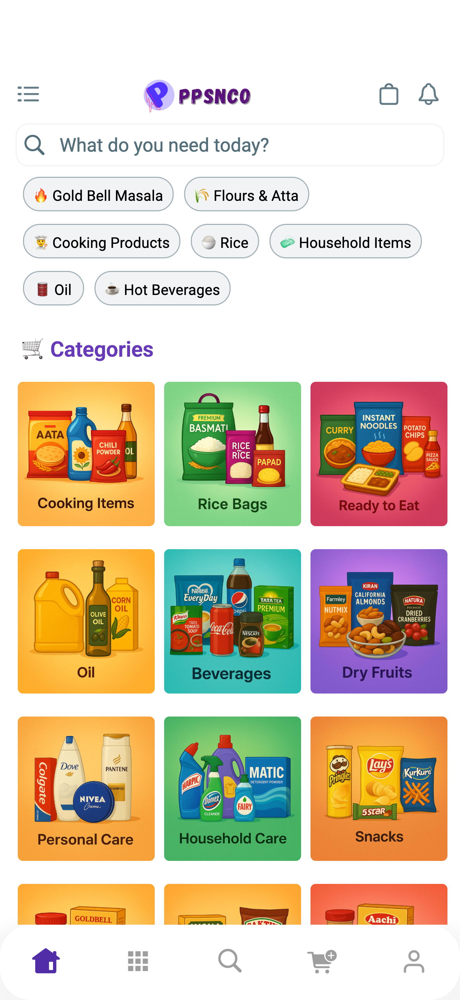
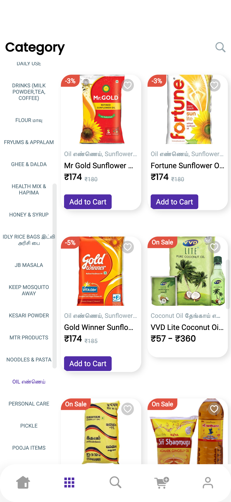
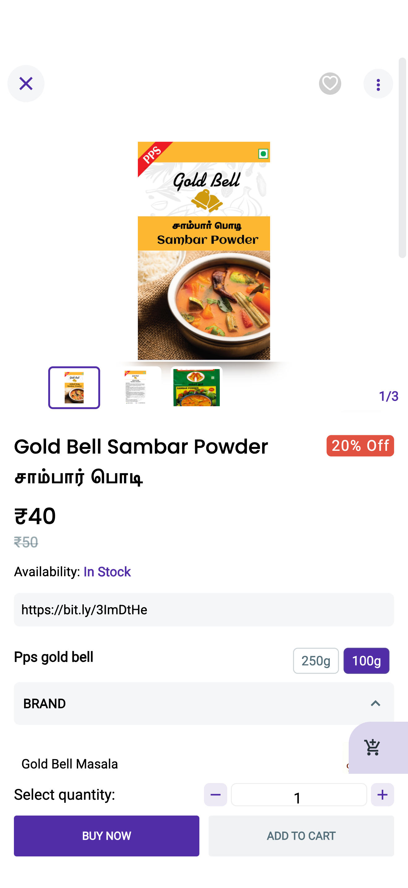
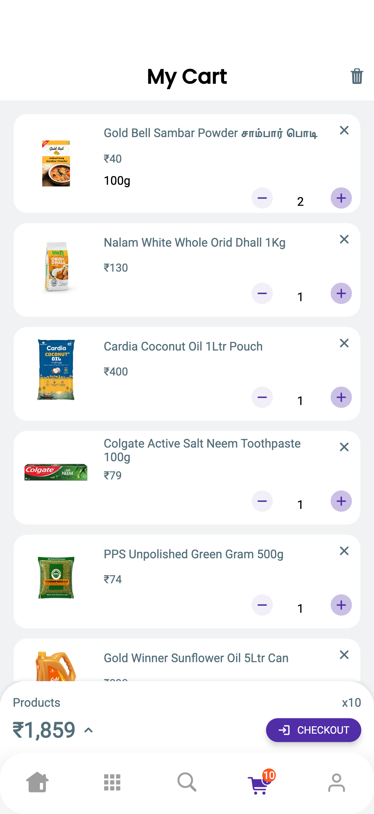
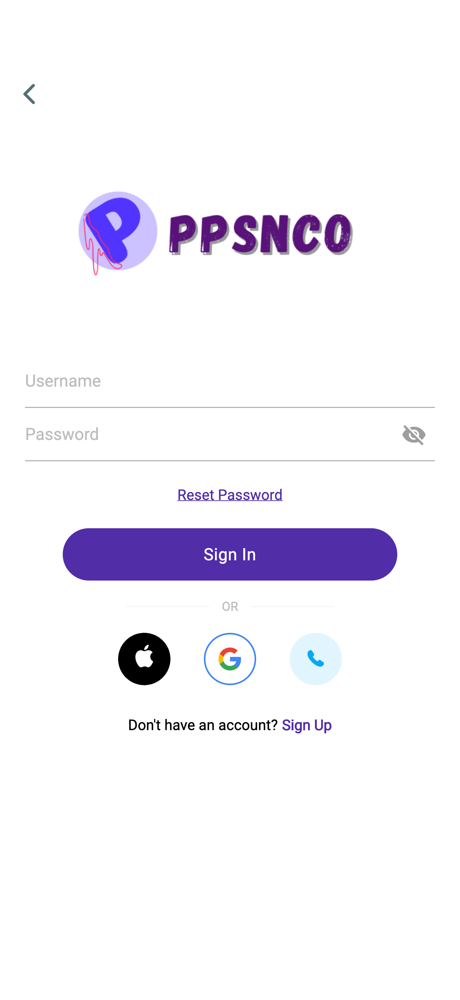

# PPSNCO Groceries Mobile App

## Live Links

🌐 Website: https://ppsnco.com

📱 Android App (Google Play Store):  
https://play.google.com/store/apps/details?id=com.ppsnco.com&hl=en_IN

🍎 iOS App (Apple App Store):  
https://apps.apple.com/in/app/ppsnco-groceries-savings/id6738369357

---

## Project Overview

PPSNCO Groceries Mobile App is a Flutter-based grocery shopping application integrated with the PPSNCO e-commerce platform. The application enables customers to browse products, search items, manage carts, place orders, and enjoy a seamless shopping experience directly from their mobile devices.

The app serves as the mobile extension of the PPSNCO online grocery platform, providing customers with convenient access to grocery shopping anytime and anywhere.

---

## My Contributions

- Managed and maintained the mobile application
- Integrated the application with WooCommerce APIs
- Published and managed Android & iOS applications
- Configured payment workflows
- Improved app performance and user experience
- Managed application releases and updates
- Enhanced customer shopping experience
- Worked on feature enhancements and platform improvements

---

## Technologies Used

### Mobile Application
- Flutter

### Backend
- WordPress
- WooCommerce
- WooCommerce REST API

### Infrastructure
- Hostinger Cloud Hosting
- Cloudflare CDN

### Payments
- Razorpay

---

## Key Features

- Product Browsing
- Category Navigation
- Product Search
- Customer Login & Registration
- Shopping Cart
- Secure Checkout
- Online Payments
- Order Tracking
- Customer Account Management
- Mobile-Friendly User Interface
- Real-Time Product Catalog Integration

---

## Screenshots

### Homepage

### Categories

### Product Page

### Cart Page

### Login Page

---

## Project Impact

- Extended PPSNCO's digital presence to mobile platforms
- Improved customer accessibility and convenience
- Enabled seamless shopping on Android and iOS devices
- Integrated directly with the PPSNCO e-commerce ecosystem
- Enhanced customer engagement through mobile commerce
- Improved shopping experience for returning customers

---

## App Highlights

- Available on Android & iOS
- Integrated with WooCommerce
- Secure Online Payments
- Real-Time Product Synchronization
- Customer Account Management
- Order Management System
- Mobile-Optimized Shopping Experience

---

## Downloads

### Android
https://play.google.com/store/apps/details?id=com.ppsnco.com&hl=en_IN

### iOS
https://apps.apple.com/in/app/ppsnco-groceries-savings/id6738369357

---

## Author

**Subhash Murugesan**  
Associate Software Engineer | BCA Graduate

### Connect With Me

- GitHub: https://github.com/subhzzzz
- LinkedIn: https://www.linkedin.com/in/subhzzz
